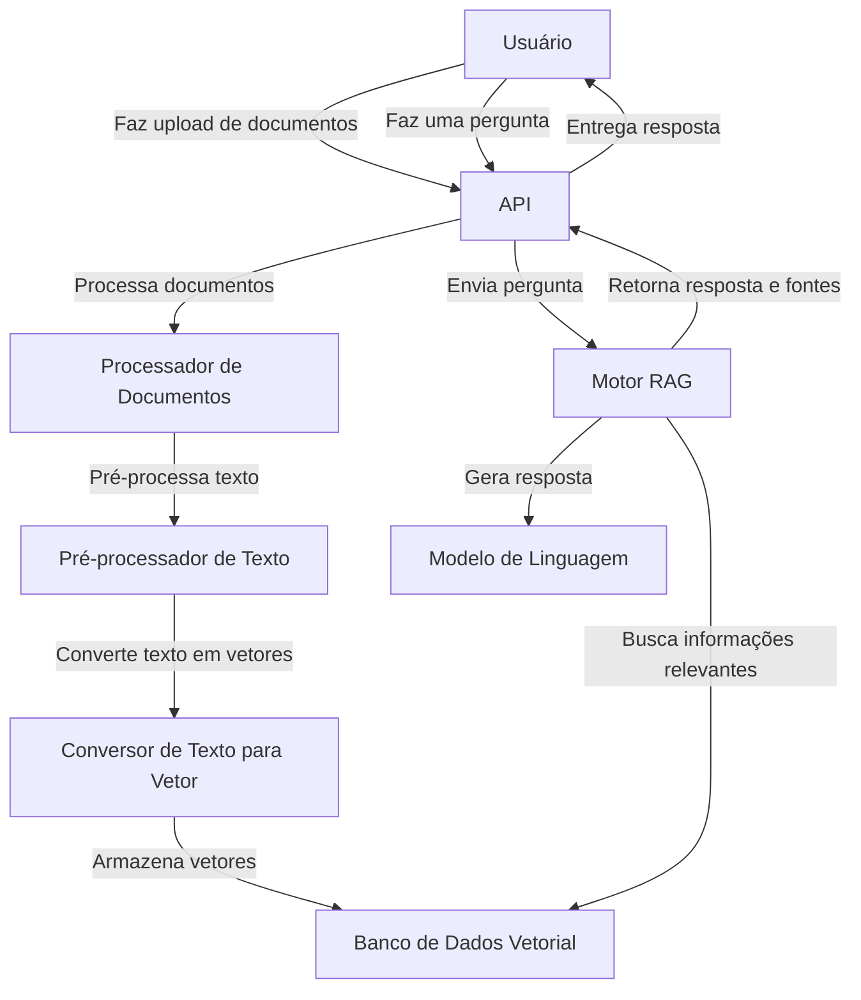

# Arquitetura do Sistema RAG (Retrieval-Augmented Generation)

Este documento descreve a arquitetura de alto nível do sistema de Geração Aumentada de Recuperação (RAG) implementado com Python, LangChain, OpenAI e FastAPI.

## Visão Geral do Sistema

O sistema RAG é projetado para processar documentos em vários formatos, pré-processá-los, armazená-los eficientemente como vetores e responder a perguntas com base no conteúdo desses documentos.

## Componentes Principais

1. **API (main.py)**: 
   - Interface para usuários fazerem upload de documentos e enviarem perguntas.
   - Implementada usando FastAPI para eficiência e documentação automática.
   - Endpoints principais: `/upload_documents` e `/query`.

2. **Processador de Documentos (document_processor.py)**:
   - Responsável por carregar e segmentar documentos em partes menores.
   - Suporta múltiplos formatos: TXT, PDF, DOCX, XLSX, HTML, CSV.
   - Utiliza bibliotecas específicas para cada formato (e.g., PyPDF2, python-docx, openpyxl).

3. **Pré-processador de Texto (text_preprocessor.py)**:
   - Novo componente adicionado para melhorar a qualidade dos vetores.
   - Realiza tarefas como:
     - Conversão para minúsculas
     - Remoção de stopwords
     - Tokenização
   - Utiliza NLTK para processamento de linguagem natural.

4. **Conversor de Texto para Vetor**:
   - Converte segmentos de texto pré-processados em representações vetoriais.
   - Utiliza OpenAI Embeddings para criar vetores de alta qualidade.

5. **Banco de Dados Vetorial (vector_db.py)**:
   - Armazena e indexa vetores para busca eficiente.
   - Implementado usando FAISS para pesquisas rápidas de similaridade.
   - Suporta persistência em disco para manter os dados entre reinicializações.

6. **Motor RAG (rag_engine.py)**:
   - Coordena o processo de recuperação de informações e geração de respostas.
   - Utiliza LangChain para integrar o banco de dados vetorial com o modelo de linguagem.
   - Implementa a lógica de busca e geração de respostas.

7. **Modelo de Linguagem**:
   - Gera respostas baseadas nas informações recuperadas.
   - Utiliza o modelo GPT da OpenAI através da API do OpenAI.

## Fluxo de Funcionamento

1. **Upload e Processamento de Documentos**:
   - O usuário faz upload de documentos através da API.
   - Os documentos são processados e divididos em segmentos pelo Processador de Documentos.
   - Cada segmento passa pelo Pré-processador de Texto para limpeza e normalização.
   - Os segmentos pré-processados são convertidos em vetores.
   - Os vetores são armazenados no banco de dados vetorial junto com os metadados do documento.

2. **Processo de Consulta**:
   - O usuário faz uma pergunta através da API.
   - A pergunta é pré-processada e convertida em um vetor.
   - O sistema busca no banco de dados vetorial os segmentos mais similares à pergunta.
   - Os segmentos relevantes são recuperados.

3. **Geração de Resposta**:
   - A pergunta original e os segmentos recuperados são combinados em um prompt.
   - Este prompt é enviado para o modelo de linguagem.
   - O modelo gera uma resposta baseada nas informações fornecidas.
   - A resposta é formatada, incluindo metadados sobre as fontes usadas.

4. **Entrega da Resposta**:
   - A API retorna a resposta formatada ao usuário, incluindo:
     - A pergunta original
     - A resposta gerada
     - Informações sobre as fontes utilizadas (título do documento, etc.)

## Considerações Técnicas

- O sistema é modular, permitindo fácil manutenção e expansão.
- A escolha do FAISS como banco de dados vetorial permite escalabilidade para grandes volumes de dados.
- O uso do FastAPI proporciona uma API rápida e bem documentada.
- A integração com OpenAI através do LangChain permite flexibilidade para trocar ou atualizar modelos de linguagem no futuro.
- O pré-processamento de texto melhora a qualidade das embeddings e, consequentemente, a precisão das respostas.
- O sistema utiliza variáveis de ambiente para configurações sensíveis, como chaves de API.

Este design permite que o sistema forneça respostas precisas e contextualizadas, baseadas no conteúdo dos documentos carregados, sempre indicando as fontes das informações utilizadas.