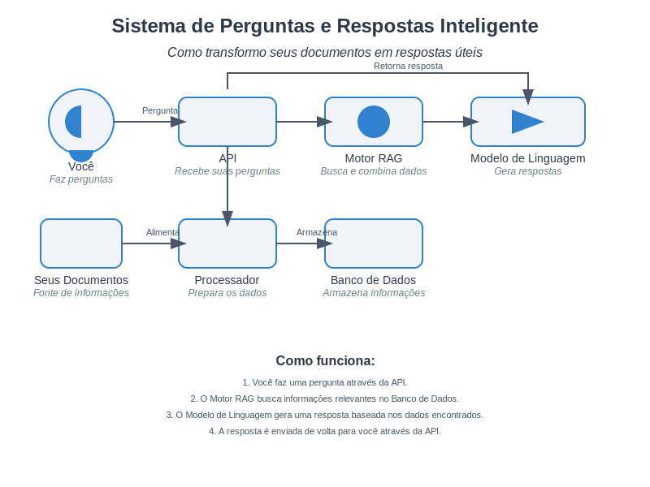

# Sistema RAG com Python, LangChain e FastAPI

Este projeto implementa um sistema de Recuperação Aumentada por Geração (RAG) utilizando Python, LangChain, OpenAI e FastAPI.

## Visão Geral

O sistema é capaz de processar documentos em vários formatos (TXT, PDF, DOCX, XLSX, HTML, CSV e outros formatos de texto), convertê-los em representações vetoriais, armazená-los eficientemente e fornecer respostas contextualizadas através de uma API REST.



## Requisitos

- Python 3.12.5+
- Dependências listadas em `requirements.txt`

## Instalação

1. Clone o repositório:
   ```
   git clone https://github.com/blpilla/langchain-openai-fastapi.git
   cd langchain-openai-fastapi
   ```

2. Crie e ative um ambiente virtual:
   ```
   python -m venv venv
   source venv/bin/activate  # No Windows use `venv\Scripts\activate`
   ```

3. Instale as dependências:
   ```
   pip install -r requirements.txt
   ```

4. Configure as variáveis de ambiente:
   Crie um arquivo `.env` na raiz do projeto e adicione sua chave API do OpenAI:
   ```
   OPENAI_API_KEY=sua_chave_api_aqui
   ```

## Uso

1. Inicie o servidor:
   ```
   uvicorn main:app --reload
   ```

2. Acesse a documentação interativa da API:
   Abra um navegador e vá para `http://localhost:8000/docs`

3. Teste a API usando o Swagger UI:
   
   a. Upload de Documentos:
      - Clique no endpoint POST `/upload_documents`
      - Clique em "Try it out"
      - Use o botão "Choose File" para selecionar um ou mais arquivos
      - Clique em "Execute" para fazer o upload

   b. Fazer uma Consulta:
      - Clique no endpoint POST `/query`
      - Clique em "Try it out"
      - Insira sua pergunta no campo "question" do corpo da requisição
      - Clique em "Execute" para enviar a consulta

4. Alternativamente, use curl para interagir com a API:

   Upload de documentos:
   ```
   curl -X POST "http://localhost:8000/upload_documents" \
        -H "Content-Type: multipart/form-data" \
        -F "files=@/caminho/para/seu/arquivo.pdf" \
        -F "files=@/caminho/para/seu/arquivo.csv"
   ```

   Fazer uma consulta:
   ```
   curl -X POST "http://localhost:8000/query" \
        -H "Content-Type: application/json" \
        -d '{"question": "Qual é o tema principal dos documentos?"}'
   ```

## Estrutura do Projeto

```
.
├── src/
│   ├── document_processor.py
│   ├── text_preprocessor.py
│   ├── vector_db.py
|   └── rag_engine.py
├── tests/
│   ├── test_document_processor.py
│   ├── test_text_preprocessor.py
│   ├── test_vector_db.py
│   └── test_rag_engine.py
├── .env
├── .gitignore
├── main.py
├── requirements.txt
└── README.md
```

## Características Principais

- Processamento de múltiplos formatos de documento (TXT, PDF, DOCX, XLSX, HTML, CSV e outros formatos de texto)
- Pré-processamento de texto para melhorar a qualidade dos vetores e otimizar o desempenho
- Conversão de texto para vetores usando OpenAI Embeddings
- Armazenamento eficiente de vetores usando FAISS
- Motor RAG para recuperação de informações e geração de respostas
- API REST com FastAPI para interação com o sistema
- Documentação interativa com Swagger UI
- Persistência do banco de dados vetorial para manter o conhecimento

## Contribuindo

Contribuições são bem-vindas! Por favor, leia as diretrizes de contribuição antes de submeter pull requests.

## Licença

Este projeto está licenciado sob a [MIT License](https://opensource.org/licenses/MIT).